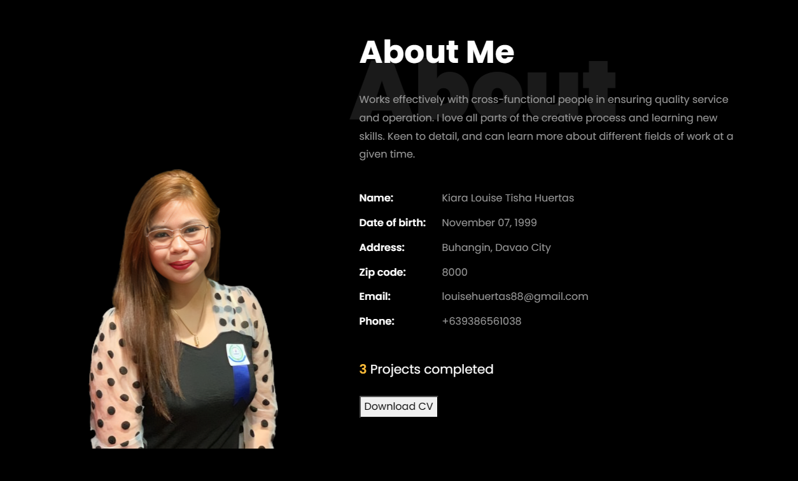
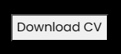

Kiara Huertas' Professional Portfolio
=====================================

**Live Site:** [louieeim.github.io](https://louieeim.github.io/)

This is the responsive CV website of Kiara Huertas, showcasing expertise and accomplishments in programming, photo and video editing, and digital marketing.

Introduction
------------

Welcome to Kiara's professional portfolio, a digital showcase highlighting my expertise and accomplishments in programming, photo and video editing, and digital marketing. Built using HTML, CSS, and JavaScript, this website is designed to offer a comprehensive overview of my professional journey, skills, and projects. Aimed at potential employers, clients, and colleagues, it provides detailed insights into my technical capabilities, work experience, and creative endeavors. Explore my portfolio to discover how I can contribute to your projects with my unique blend of innovative problem-solving, coding skills, and a passion for continuous learning.

Getting Started
---------------

Navigating through Kiara's professional portfolio is straightforward and intuitive, designed to provide you with a seamless and informative experience.

### Exploring the Portfolio

*   **Home Page**: A brief introduction to me and my work.
*   **About Me**: Get to know more about who I am, both professionally and personally.
*   **Resume**: Detailed work history, roles, key responsibilities, and my educational background.
*   **Projects**: Examples of my work and contributions to various initiatives.
*   **Skills**: A comprehensive list of tools and technologies I'm proficient with, showcasing my areas of expertise.
*   **Contact**: Information on how to get in touch with me for opportunities, collaborations, or inquiries.

#### Additional Tips

*   **Navigation Menu**: Use the navigation menu for quick access to different sections of the portfolio.

  

*   **Download CV**: A "Download CV" button above the "Resume" page allows you to download a copy of my CV in PDF format, regularly updated to reflect my latest experiences and achievements.

  
    
  

Prerequisites
-------------

### For the Public

Access my portfolio easily through the provided link.

### For Developers and/or Contributors

*   **Git**: Familiarity with Git for cloning the repository and managing version control.
    
    bashCopy code
    
    `git clone https://github.com/username/repository-name.git cd repository`
    
*   **Web Technologies**: Basic understanding of HTML, CSS, and JavaScript is required for modifications or enhancements.
*   **Text Editor**: Use any text editor or IDE of your choice (e.g., VS Code, Sublime Text, Atom).

### Contribution Steps

markdownCopy code

``1. Fork the project 2. Create your feature branch (`git checkout -b feature/AmazingFeature`) 3. Commit your changes (`git commit -m 'Add some AmazingFeature'`) 4. Push to the branch (`git push origin feature/AmazingFeature`) 5. Open a pull request``

License
-------

Copyright © 2024 All rights reserved | This template is made with ♥ by [Colorlib](https://colorlib.com).

Contact
-------

Connecting with me is easy and can be done through multiple channels:

*   [**EMail**(louisehuertas88@gmail.com)
*   [**LinkedIn**](https://www.linkedin.com/in/kiarahuertas28/)
*   [**GitHub**](https://l.facebook.com/l.php?u=https%3A%2F%2Flouieeim.github.io%2F%3Ffbclid%3DIwAR35W8w8D3O7bs-oAIIlJbW7Mqgx3UYhNF04HUFloT4LsjZ-VPUL8uPvg5I_aem_AR9wbmERU-q0DRN6BviLvFsaC1LGzoP9rU3DvjxDDZzuTMvk7lUcTMUY2VyVEMKrH4E3MGIaLyfbtjGHAdRv4PeK&h=AT1m5wg64eMiqU8BAA9hAQit1AIyc3lTMd7Bde4amOUkitu7PYUv2y4jtfzF4ZTQdgUBuxXvLtjvqAC3SDAEsDzjjTSNmyQSTOQUEexxkenXyfcHRxOglEHrEmP3GXBKo1N9UQ)
*   [**Discord**](https://l.facebook.com/l.php?u=http%3A%2F%2Fdiscordapp.com%2Fusers%2F301734829555449856%3Ffbclid%3DIwAR0o8lE3r7dIgE3M2KPFxS8av-10fb7nq-moZqHMyuS5HXqz4hIQZUoxPFs_aem_AR9io3xko-_07Pv-aVfN94b8yiZ9CWDYbHQrGzr6NGkdXa1A6Be2TNJNw0-TU4s3IJeyK7nqVF1DPDT0lqV23Ikl&h=AT1m5wg64eMiqU8BAA9hAQit1AIyc3lTMd7Bde4amOUkitu7PYUv2y4jtfzF4ZTQdgUBuxXvLtjvqAC3SDAEsDzjjTSNmyQSTOQUEexxkenXyfcHRxOglEHrEmP3GXBKo1N9UQ)

For any immediate inquiries or discussions, please feel free to use the email channel for a faster response.

Acknowledgments
---------------

*   [How to Write Good Documentation](https://guides.lib.berkeley.edu/how-to-write-good-documentation)
*   [Chat with OpenAI](https://chat.openai.com/)
*   [Blackbox AI](https://www.blackbox.ai/)
*   [Make a README](https://www.makeareadme.com/)
